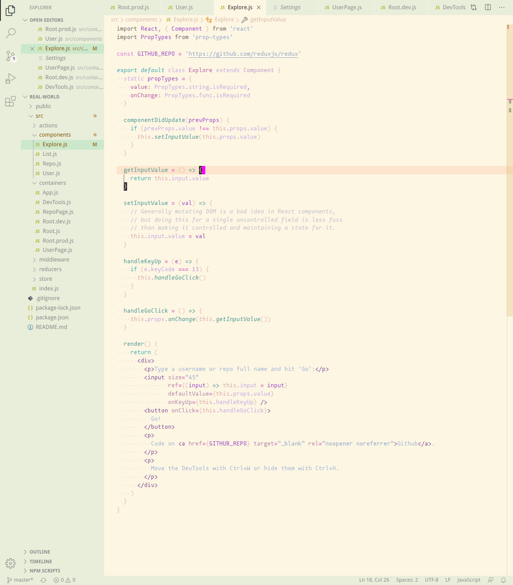

# Oasis

### Light mellow syntax theme for [VS Code](https://code.visualstudio.com/)

Soft colors with the emphasis on variables.
 
This theme is based around being easy on the eye on both bright as dimmed environments.

The font used in the screenshot is [mononoki](https://madmalik.github.io/mononoki/)

## Installation
1. Open the Extensions sidebar in VS Code
2. Search for *Oasis*
3. Click Install
4. Open the Command Palette with Ctrl+Shift+P or ⇧⌘P
5. Select Preferences: Color Theme and choose *Oasis*.

### What's new?
Click here to go to the [Changelog](https://github.com/rumboon/oasis-theme-vscode/blob/master/CHANGELOG.md).

### Contributing
If you find any inconsistency in a language, you can report an issue [here](https://github.com/rumboon/oasis-theme-vscode/issues). Please provide an example of the issue itself.